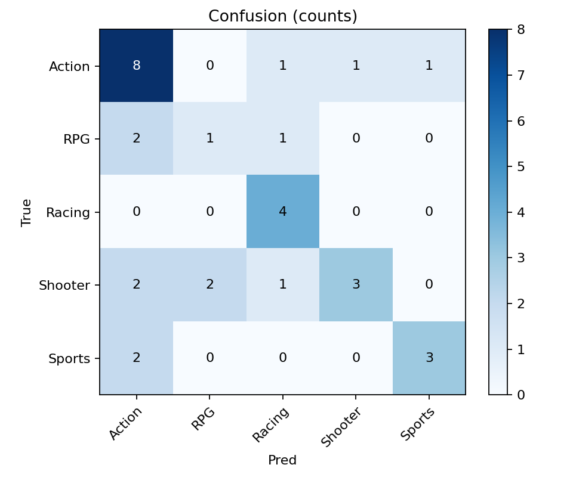
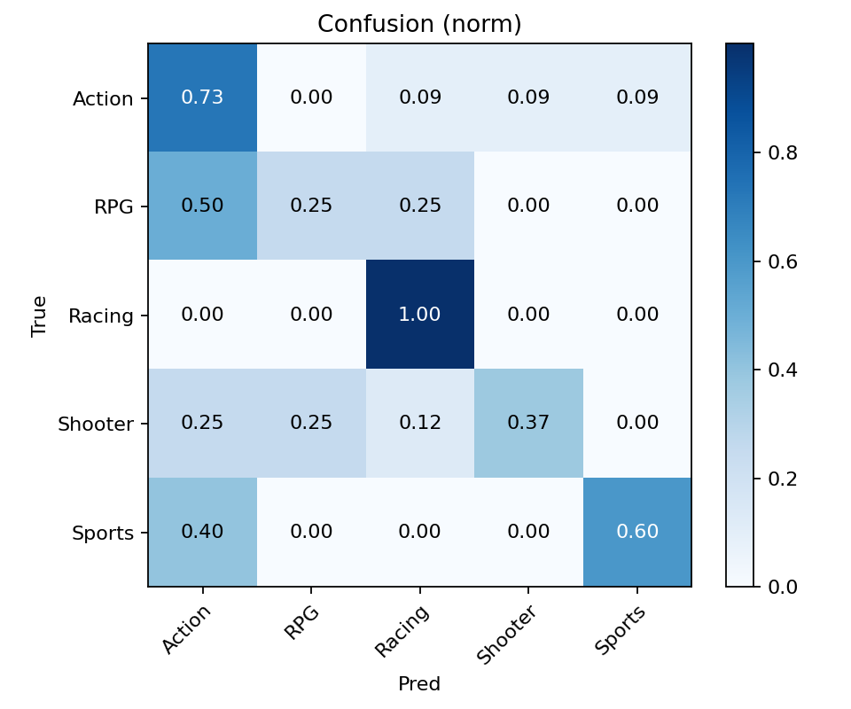

**Open in Colab:** [(https://colab.research.google.com/drive/1rxOH0-Kod12wjWut2GEiWtGczXdzDTfQ?usp=sharing)]
# Xbox Genre Vision Classifier

Transfer learning demo that predicts **game genres from cover art**.  
Built for an Applied Scientist (Gaming AI) application — focuses on clean pipeline, reproducible training, and clear evaluation.

## TL;DR
- **Model:** ResNet18 (ImageNet weights) → replace final layer for 5 classes
- **Data:** {TOTAL_IMAGES} covers across {NUM_CLASSES} genres (train={N_TRAIN}, val={N_VAL})
- **Metric:** Best validation accuracy **{BEST_VAL_ACC}%**
- **Extras:** Confusion matrix plots, per-class precision/recall/F1, optional embedding-based similarity search

---

## Why this project?
Covers encode strong visual cues (athletes for Sports, cars for Racing, swords/dragons for RPG, etc.).  
This makes it a compact, high-signal task for testing a **vision pipeline + evaluation discipline** that maps cleanly to game ML workflows.

---

> **Note:** I do **not** commit raw images or `.pt` files; see `.gitignore`.

---

## Setup (Colab)

1. Open the notebook in Google Colab.
2. Run **Chunk 1** to create folders and set config.
3. Add images:
   - **Option A:** drag/drop covers into `data/raw/<Genre>/`
   - **Option B:** paste URLs and run the download helper
4. Run **Chunk 2–4** (dataset, training, evaluation).
5. (Optional) Run **embeddings + similarity search**.

---

## Results

- **Data:** 164 covers (train=132, val=32)  
- **Classes:** Action, RPG, Racing, Shooter, Sports  
- **Best validation accuracy:** **59.4%**

**Confusion matrices:**

---

## How it works (short)

- **Transforms:** resize to 224, light augmentation (flip, jitter) for generalization
- **Backbone:** `torchvision.models.resnet18` with ImageNet weights
- **Head:** final FC replaced for `{NUM_CLASSES}` outputs
- **Training:** CrossEntropy + AdamW + cosine LR schedule
- **Eval:** confusion matrices + per-class precision/recall/F1
- **Repro:** fixed seed for splits & loaders

---

## Limitations & Next Steps

- **Small dataset:** genre signal is strong, but more covers would improve robustness.
- **Label leakage risk:** some covers share publisher/series style; future work could add series-aware splits.
- **Next:** try ViT/BiT backbones, stronger aug (RandAugment), and calibration (temperature scaling).

---

## Usage Notes / Attribution

- Cover images were used for **educational & non-commercial demo purposes** only.  
- Please replace with your own licensed images for production use.

